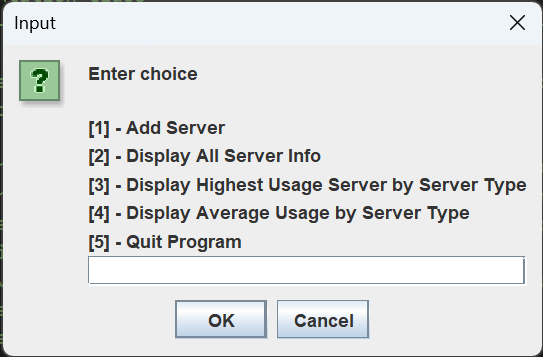
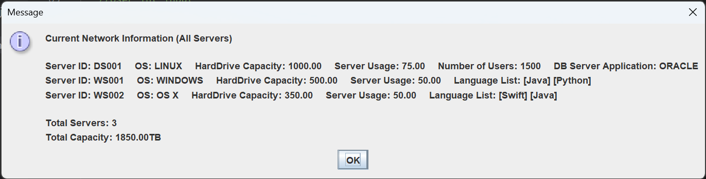

# My Java Projects
All my Java practice projects will go here. I will add project information and screenshots as I update repo.

## JDBC
Project using JDBC API to test MySQL functionality with Java.
Skills learned: Using APIs, MySQL CRUD operations via JDBC API

## Mock Server IT 206 Project
Use Java Swing library to display GUI windows for user input allowing for the creation, display, or deletion of Server objects. User can choose type of server, operating system used, and storage capacity in TB, after which the created object is stored in a Server array. User can also display information regarding the created Servers.
Concepts learned: GUI via Swing, extending abstract superclasses to subclasses, storing objects in arrays, user input via GUI.

## Hash Table IT 306 Project
Implement hand-made ArrayList as a HashTable data structure which reads student data from .csv file and stores/retrieves said data into HashTable structure using sum and polynomial ASCII hash keys. Test console displays results of stored and retrieved query in TestHashTable.java implementation.
Skills learned: storing and retrieving data using HashTable, reading data from external file (.csv in this case), minimize minimize collisions using different hashing methods (sum vs polynomial).
